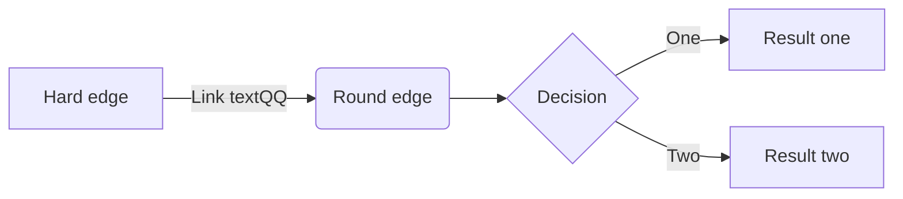

+++
title= "机器学习笔记"
date= 2018-09-06T07:00:00+08:00
draft= false
categories = ["ml","DL","AI"]
tags = ["study","calcute"]
toc = true
author = "zls3201"
author_homepage =  "http://www.zls3201.com/"
+++

# ML

## 资料整理
[机器学习课程](https://zh.coursera.org/learn/machine-learning) 
[网易公开课_吴恩达_机器学习_2008](http://open.163.com/special/opencourse/machinelearning.html)
[斯坦福机器学习笔记](https://www.gitbook.com/book/yoyoyohamapi/mit-ml)
[机器学习第九期](https://www.julyedu.com/course/getDetail/110)
[数据挖掘十大算法详解](https://legacy.gitbook.com/book/wizardforcel/dm-algo-top10/details) 
[机器学习基础：案例研究](https://www.coursera.org/learn/ml-foundations) 
[神经网络_fast.ai](http://www.fast.ai/)
西瓜书
机器学习实践


https://www.csie.ntu.edu.tw/~htlin/ 

## 1.常见问题
1. 监督学习与非监督学习
2. 参数学习与非参数学习
3. 判定模型与生成模型
 
```text

https://www.zhihu.com/question/20446337/answer/45130939

 

我是这样理解的： 

生成模型，就是生成（数据的分布）的模型； 

判别模型，就是判别（数据输出量）的模型； 

更进一步： 

从结果角度，两种模型都能给你 输出量（label 或 y etc.)。 

但，生成模型的处理过程会告诉你关于数据的一些统计信息（p(x|y) 分布 etc.），更接近于统计学； 

而 判别模型则是通过一系列处理得到结果，这个结果可能是概率的或不是，这个并不改变他是不是判别的。 

如，决策树的if then说不是这个就是那个（而很多属性都是有分布的）【即分支】，明显是一种 判别 嘛； 

而朴素贝叶斯说，p( cancer , fat ) = x% etc.，模型 生成 了一个分布给你了，即使你没意识到/没用到，只用到 p( cancer | fat ) = y% 这个最终的判别。 

你再理解一下： 

k近邻法、感知机、逻辑斯谛回归模型、最大熵模型、支持向量机、提升方法是判别模型； 

隐马尔可夫模型（重点的EM算法）是生成模型。 
```


## 2.常用算法

### 2.1 线性回归

#### 2.1.1 局部加权线性回归
~~~
https://blog.csdn.net/Allenalex/article/details/16370245 
https://blog.csdn.net/tianse12/article/details/70161591 
https://blog.csdn.net/herosofearth/article/details/51969517 
~~~

#### 2.1.2 广义线性模型

### 2.2 逻辑回归
#### 2.2.1 SoftMax回归

### 2.3 感知器算法

### 生成学习算法
#### 高斯判别分析
#### 朴素贝叶斯
##### 垃圾邮件分类
##### Laplcae平滑

### SVM（支持向量机）
### KNN(K近邻算法)
https://blog.csdn.net/suipingsp/article/details/41964713 

https://www.cnblogs.com/ybjourney/p/4702562.html 

#### 欧氏距离与曼哈顿距离
### 决策树
https://zh.wikipedia.org/wiki/%E5%86%B3%E7%AD%96%E6%A0%91 

 

http://www.cnblogs.com/leoo2sk/archive/2010/09/19/decision-tree.html 

 

https://www.cnblogs.com/pinard/p/6050306.html 

### 朴素贝叶斯分类

### 神经网络
#### 卷积神经网络
#### 循环神经网络

## 数学基础
### 微积分
反函数求导
矩阵微分
牛顿法
海森矩阵
梯度下降
批量梯度下降
随即梯度下降
自然对数e是如何发现的

### 概率论与数理统计
概率分布
指数族分布
伯努力分布
高斯分布（正态分布）
多元正态分布
伽马分布

概率质量函数与概率密度函数

似然估计
极大似然估计
Join似然估计
最小二乘法

贝叶斯

### 线性代数与场论
#### 矩阵迹运算
#### 矩阵的秩与满秩矩阵
#### 矩阵分解与奇异值分解

### 常用算法
#### 牛顿法
#### 最小二乘法
#### 似然估计
#### 高斯下降
